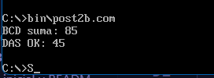
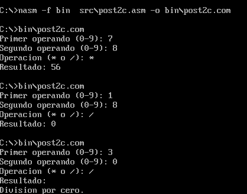

# Laboratorio Unidad - Operaciones Aritméticas (NASM)

## Descripción
Implementación de programas en ensamblador x86 que utilizan instrucciones aritméticas como ADC, SBB, DAA, DAS, MUL y DIV para realizar operaciones con números de 32 bits, BCD y cálculos básicos.

## Estructura del proyecto
- src/ → código fuente (.asm)
- bin/ → ejecutables (.com)
- capturas/ → evidencias de ejecución

## Programas
- post2.asm → suma y resta de 32 bits (ADC/SBB)
- post2b.asm → operaciones BCD (DAA/DAS)
- post2c.asm → calculadora básica (MUL/DIV)

## Tecnologías
- NASM
- DOSBox

## Evidencias

## 1: Suma de 32 bits con ADC

Se implementó la suma de dos números de 32 bits utilizando ADD para la parte baja y ADC para la parte alta, verificando la correcta propagación del acarreo.

## 2: Resta de 32 bits con SBB

Se implementó la resta de números de 32 bits utilizando SUB y SBB, asegurando la correcta propagación del préstamo entre palabras.

## 3: Suma BCD con DAA

Se implementó la suma de números en formato BCD utilizando la instrucción DAA para ajustar el resultado a un valor decimal válido.

## 4: Resta BCD con DAS

Se implementó la resta en formato BCD utilizando DAS para ajustar correctamente el resultado.

## 5: Mini calculadora con MUL y DIV

Se implementó una calculadora básica que realiza operaciones de multiplicación y división entre dígitos, manejando correctamente la conversión ASCII y validando la división por cero.

